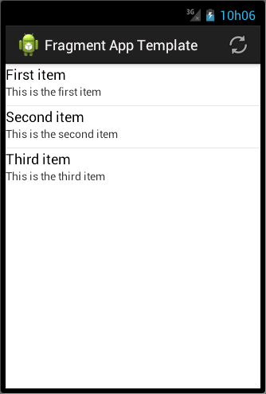

Fragment App Template
=====================

This is a template for an Android application using list and detail
fragments. On small screen devices they'll be presented in two different
activities, whereas in larger screens (such as in tablets) they'll be
side-by-side in the same activity. Details for the item selected in
the list fragment will appear in the detail fragment.

Required libraries
------------------

The following libraries are used in this application:

* ActionBarSherlock_: an extension of the support library designed to
  facilitate the use of the action bar design pattern across all versions
  of Android with a single API.

Screenshot
----------

.. _ActionBarSherlock: http://actionbarsherlock.com/
